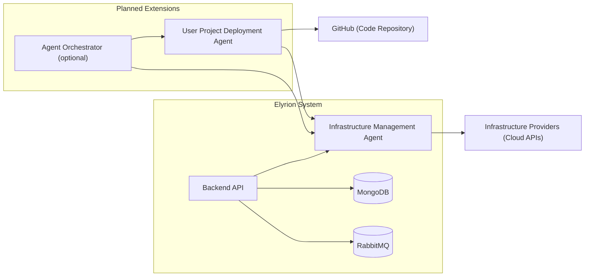

# Product Proposal  
## Elyrion — AI Agent for Automated Project Deployment

## 1. Обоснование идеи

### Прикладная задача

Современные разработчики регулярно сталкиваются с необходимостью развертывания своих проектов в облачной инфраструктуре. Даже для небольших проектов требуется выполнить множество DevOps-операций:

- подготовка инфраструктуры
- настройка окружения
- развертывание приложения
- настройка сетевого доступа
- управление ресурсами

Для большинства разработчиков, особенно создающих **pet-проекты или прототипы**, DevOps становится значительным барьером.

Разработчик должен:

- разбираться в облачных провайдерах
- понимать инфраструктуру как код (Terraform)
- конфигурировать контейнеры и среды выполнения
- управлять сетевой конфигурацией

Это требует значительного времени и отвлекает от основной задачи — разработки продукта.

### Предлагаемое решение

Проект **Elyrion** предлагает использовать **ИИ-агентов для управления инфраструктурой и развертывания проектов**.

Система уже содержит **агент управления инфраструктурой**, который способен взаимодействовать с облачными провайдерами через Terraform.

В рамках проекта предлагается добавить **второго агента — агента развертывания пользовательских проектов**, который сможет:

1. принимать ссылку на GitHub-репозиторий
2. анализировать структуру проекта
3. формировать план развертывания
4. выполнять развертывание через инфраструктурный агент

Таким образом, пользователь сможет развернуть свой проект **без ручной настройки DevOps-инфраструктуры**.

### Целевая аудитория

Основная аудитория системы:

- разработчики pet-проектов
- инженеры-энтузиасты
- небольшие команды разработки
- студенты и исследователи
- разработчики прототипов

Для этих пользователей Elyrion выступает как **DevOps-ассистент**, автоматизирующий инфраструктурную часть разработки.

---

# 2. Цель проекта и метрики успеха

## Цель проекта

Цель проекта — продемонстрировать возможность использования **агентной системы для автоматизированного развертывания пользовательских проектов**, минимизируя необходимость ручной DevOps-настройки.

PoC должен показать, что агент способен:

- понять задачу пользователя
- сформировать план развертывания
- выполнить инфраструктурные действия
- предоставить доступ к развернутому сервису

---

## Продуктовые метрики

Метрики, отражающие пользовательскую ценность системы.

**1. Время до развертывания (Time to Deploy)**  
Время от добавления репозитория до доступности сервиса.

Целевое значение: < 10 минут (без учета этапов сборки проекта и развертывания новых ресурсов у провайдера)

**2. Доля успешных развертываний**

Процент проектов, которые агент смог успешно развернуть.

Целевое значение: 70% для поддерживаемых типов проектов

**3. Количество шагов пользователя**

Количество действий пользователя для развертывания проекта.

Цель: ≤ 3 действия

Пример:

1. добавить репозиторий  
2. запросить развертывание  
3. подтвердить план

## Метрики работы агента

**1. Точность планирования инфраструктуры**

Процент случаев, когда агент корректно формирует план развертывания.

Цель: 80%

**2. Число исправлений плана пользователем**

Сколько раз пользователь отклоняет предложенный план.

Цель: < 30%

# 3. Потенциальные сценарии использования

## Базовый сценарий

1. Пользователь добавляет GitHub-репозиторий.
2. Агент анализирует проект.
3. Агент формирует план развертывания.
4. Пользователь подтверждает план.
5. Агент развертывает проект.
6. Пользователь получает доступ к сервису.

---

## Сценарий быстрого прототипирования

Разработчик создает pet-проект и хочет быстро проверить его работу в сети.

Вместо настройки инфраструктуры он:

- добавляет GitHub репозиторий
- просит агента развернуть проект

Через несколько минут получает работающий сервис.

---

## Сценарий тестирования проекта

Разработчик хочет протестировать приложение в облачной среде.

Агент автоматически:

- создает инфраструктуру
- развертывает приложение
- открывает сетевой доступ.

---

## Edge-кейсы

### 1. Репозиторий не содержит инструкции сборки

Агент может не определить:

- тип проекта
- способ запуска

В этом случае агент должен сообщить пользователю о невозможности автоматического развертывания.

---

### 2. Проект требует специфических зависимостей

Например:

- нестандартная база данных
- специфические сервисы
- GPU

В PoC такие кейсы не поддерживаются.

---

### 3. Репозиторий приватный

Пользователь должен предоставить доступ.

Без доступа агент не сможет анализировать проект.

---

### 4. Проект содержит несколько сервисов

Если репозиторий содержит сложную архитектуру (микросервисы), PoC может развернуть только основной сервис.

# 4. Ограничения

## Технические ограничения (SLO)

| Параметр | Значение |
|---|---|
| p95 latency (ответ агента на запрос пользователя) | ≤ 60 сек |
| Максимальный размер репозитория для анализа | ≤ 100 MB |
| Максимальный размер одного файла | ≤ 5 MB |
| Одновременных пользователей | ≤ 10 (PoC, single instance) |

---

## Операционные ограничения

| Параметр | Значение |
|---|---|
| Бюджет на LLM API | ~2000–3000 руб/месяц (PoC нагрузка) |
| Инфраструктура PoC | Single VPS |
| Конфигурация сервера | 2 CPU / 4 GB RAM |
| Авто-масштабирование | Не предусмотрено (PoC) |
| Количество одновременно развернутых проектов | ≤ 5 |

# 5. Архитектурный набросок

